# FlowchartTool
流程图绘图软件

### 环境
使用VS2019进行开发，build.bat是构建的脚本文件，需要将vcvarsamd64_x86.bat所在的路径替换成自己电脑上文件安装的路径。

注意：我在本地实现了国际化，国际化操作这里的代码可能无法实现，需要一些其他配置文件和操作才能实现。运行的代码是英文呈现的，可自行查找相关操作进行实现。

### 测试

#### 1.基础绘图功能

* **基础图形绘制**：提供矩形、圆形、箭头等常见基本元素，用户可以直接在绘图区域添加
* **简单图形操作**：支持对图形元素进行选中、移动、删除等操作
* **基础右键菜单**：支持复制、剪切、粘贴、删除
* **基础排列功能**：支持图形的上移/下移/置顶/置底

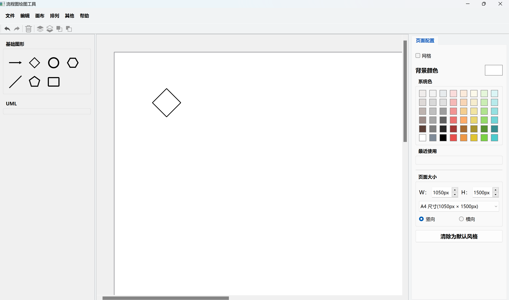
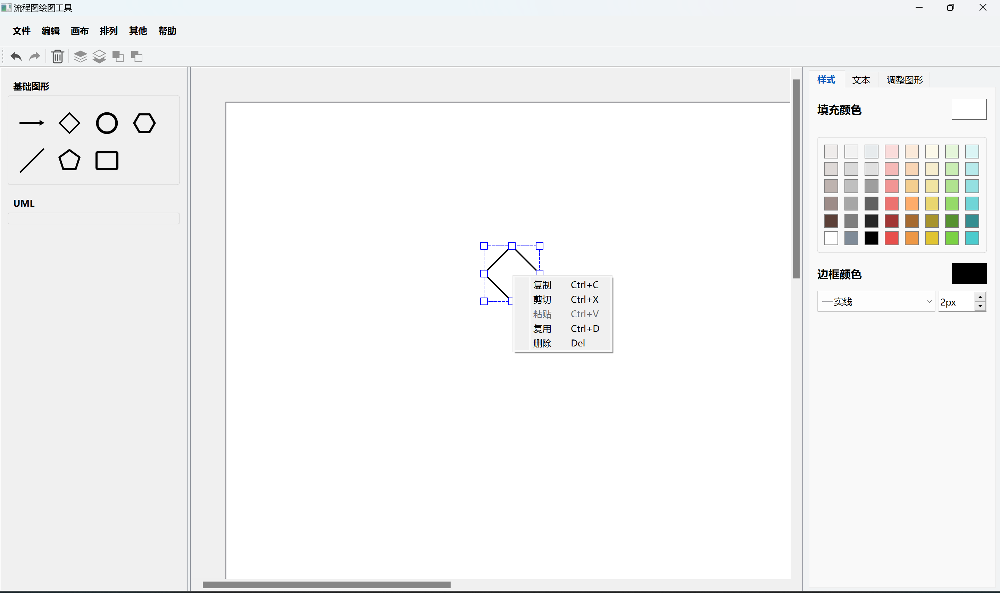
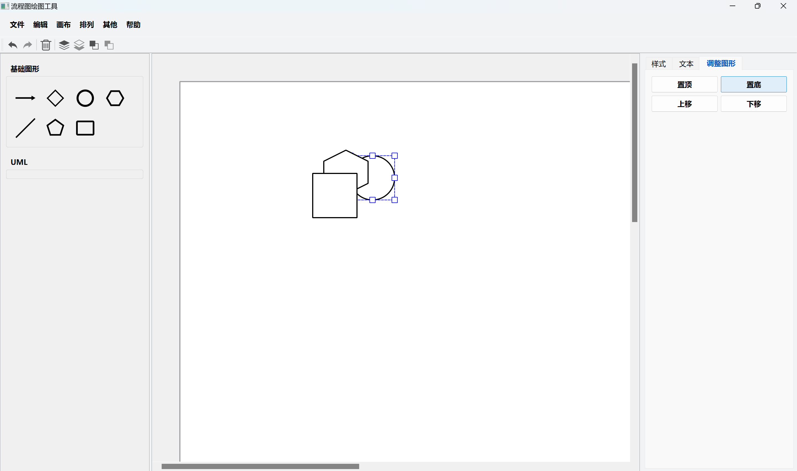

#### 2.基础连接功能

* **直线连接**：支持用直线连接图形元素，操作简单，自动吸附到图形边缘
* **连线基本设置**：可设置连接线的颜色和粗细

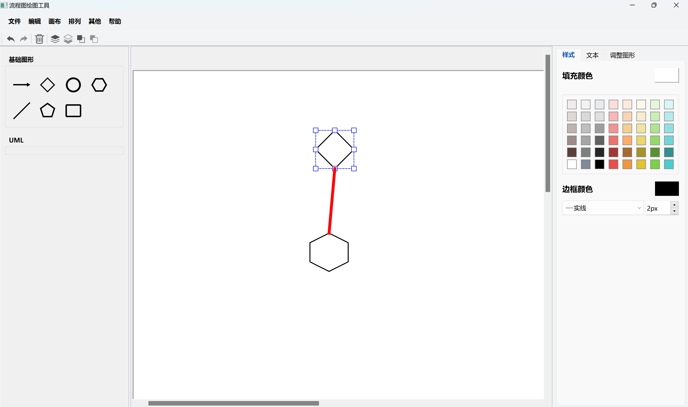

#### 3.基础文本操作

* **文本添加**：用户可以为每个图形元素添加文本说明，通过双击图形元素或使用快捷键调出文本编辑框

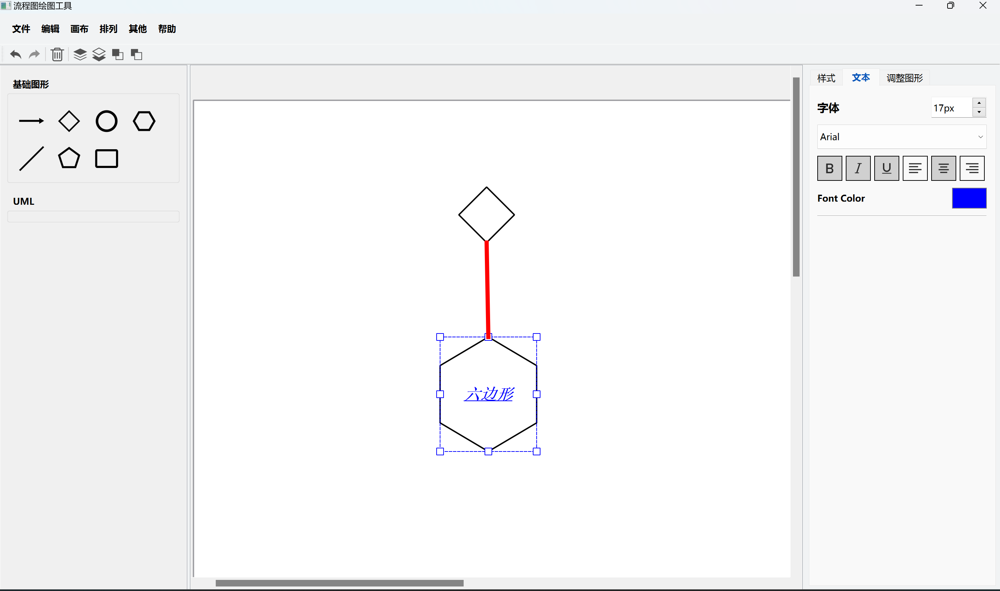

#### 4.基础文件处理

* **文件基本操作**：具备新建、打开、保存流程图文件的功能
* **常见图片导出**：
  * 支持将流程图导出为**.png**格式图片
  * 支持将流程图导出为**svg**格式文件
  * 支持打开**svg**格式文件，并且可编辑

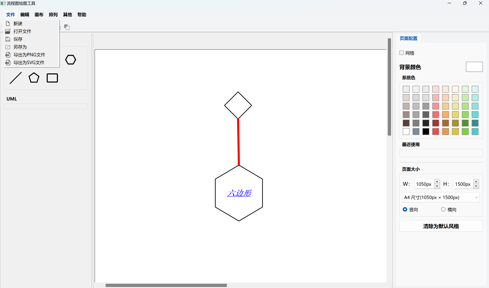
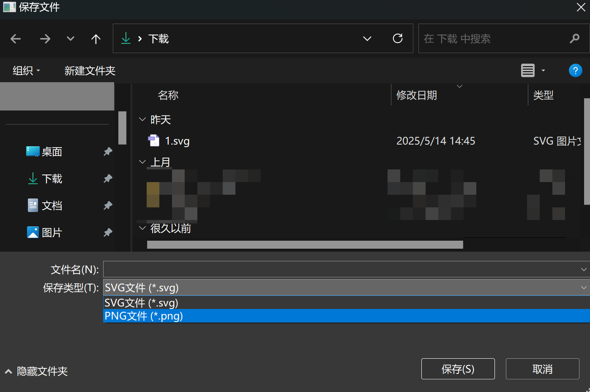

* 点击打开文件时，会弹出文件已修改的提示框，点击保存，弹出保存文件的对话框，选择文件保存路径，输入文件名，选择文件类型，点击保存后，文件保存，且会弹出打开文件对话框，选择**.svg**文件，即可打开文件显示到绘图区域；若点击不保存，则当前绘制的内容会被清空；点击取消，不会弹出打开文件对话框。

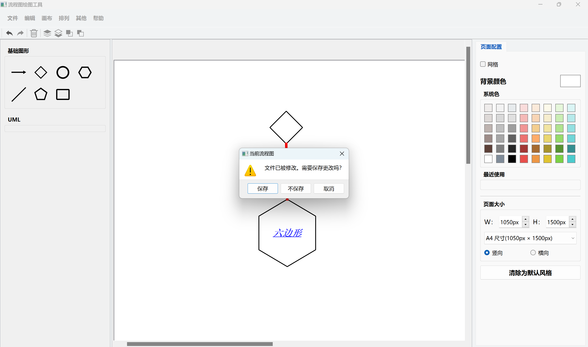
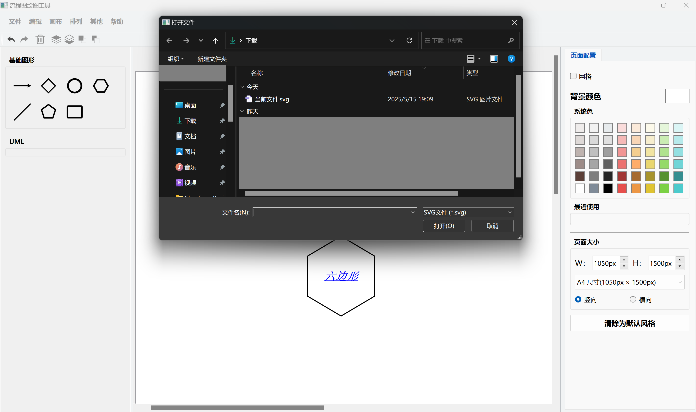
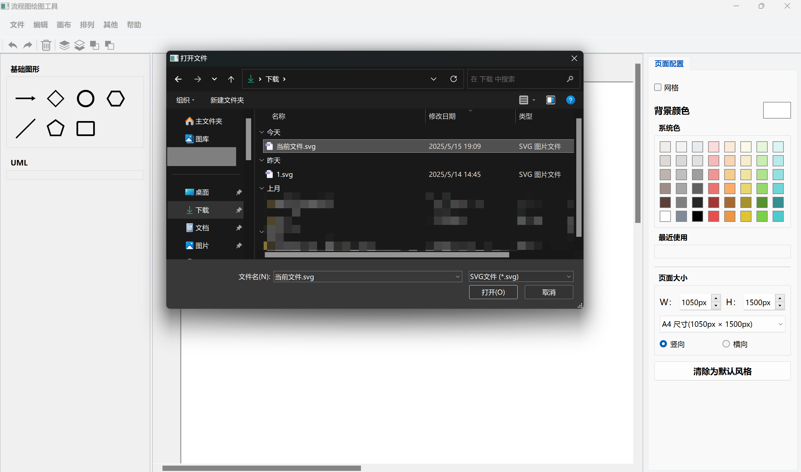

#### 5.页面设置

* **背景颜色设置**：支持设置页面背景颜色（包括系统色和最近使用）
* **页面大小设置**：支持设置页面大小
* **网格显示设置与隐藏**：支持页面网格显示与隐藏

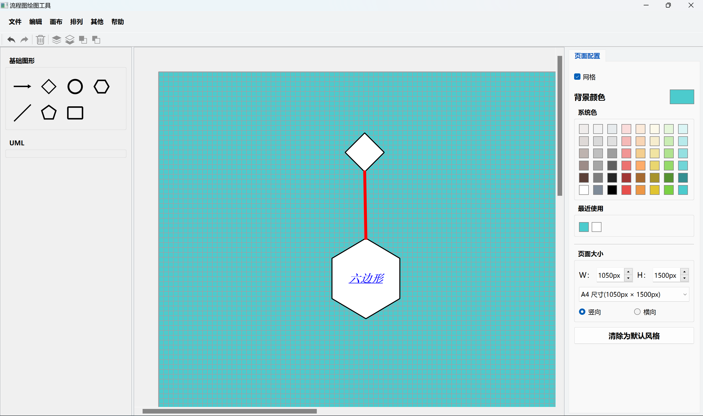

#### 6.图形属性设置

* 实现了选中图形后，对图形样式进行设置，包括图形填充颜色、边框颜色、边框线条类型、边框线条大小
* 实现了对文本的字体、字号、颜色、加粗、倾斜、下划线等格式进行设置

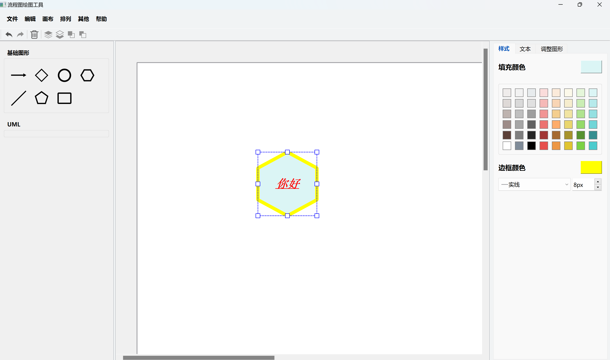

#### 7.撤销和重做

* 实现了撤销和重做功能

**最终测试样例**

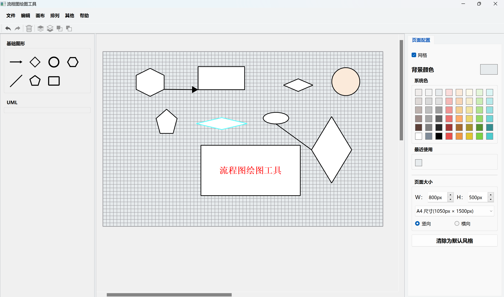
